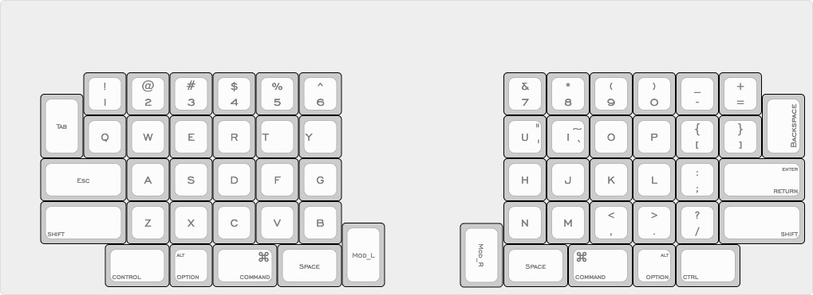
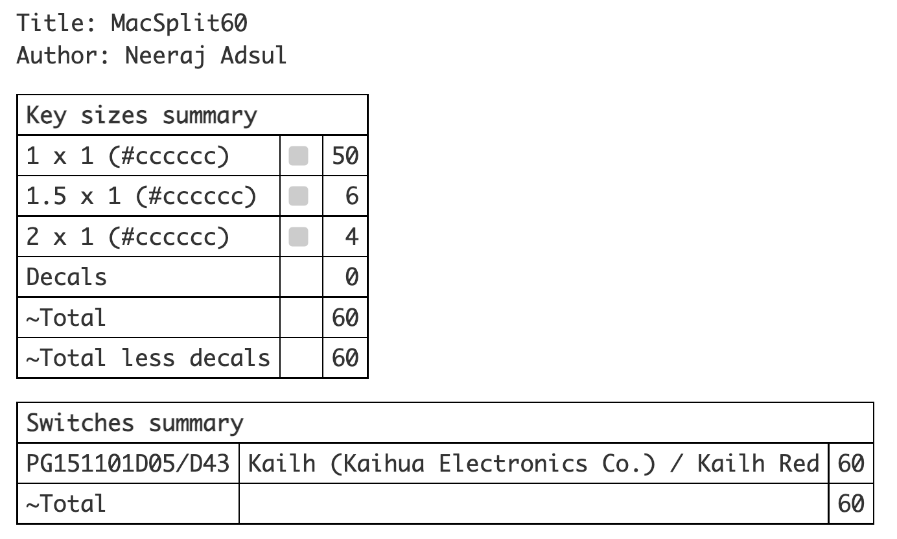

# Introduction
The goal of this document is to document design process for a split mechanical
keyboard using Macbook Pro keyboard as basis layout.
Macbook Pro keyboard (UK Layout) has following keys.

* Row-0    13  1 Esc, 12 Function keys
* Row-1    14  1 symbol, 10 numbers, Backspace
* Row-2    14  Tab, 10 letters, 2 symbols, half enter
* Row-3    14  CapsLock, 9 letters, 3 symbols, half enter
* Row-4    13  L-Shift, 7 letters, 4 symbols, R-shift
* Row-5    7   2 Cmd, 2 Alt, fn, Spacebar, Ctr

Total keys= 75

In additional there are
 - 4 Arrow keys

which makes it to 79 keys.
However, I decided to use combination of either _Mod + (H,J,K,L)_ or _Mod + (W,A,S,D)_
Also don't need the _fn_ key, 12 function keys can be added to a layer if really needed.
Caps Lock is only good for typewriters, and the corner key for tilda/backtick is maped to a layer.

So finally left with 79 - 4 - 1 - 12 - 1 - 1 = 60 keys.

# Layout
The layout was customised at keyboard-layout-editor.com as shown below.

