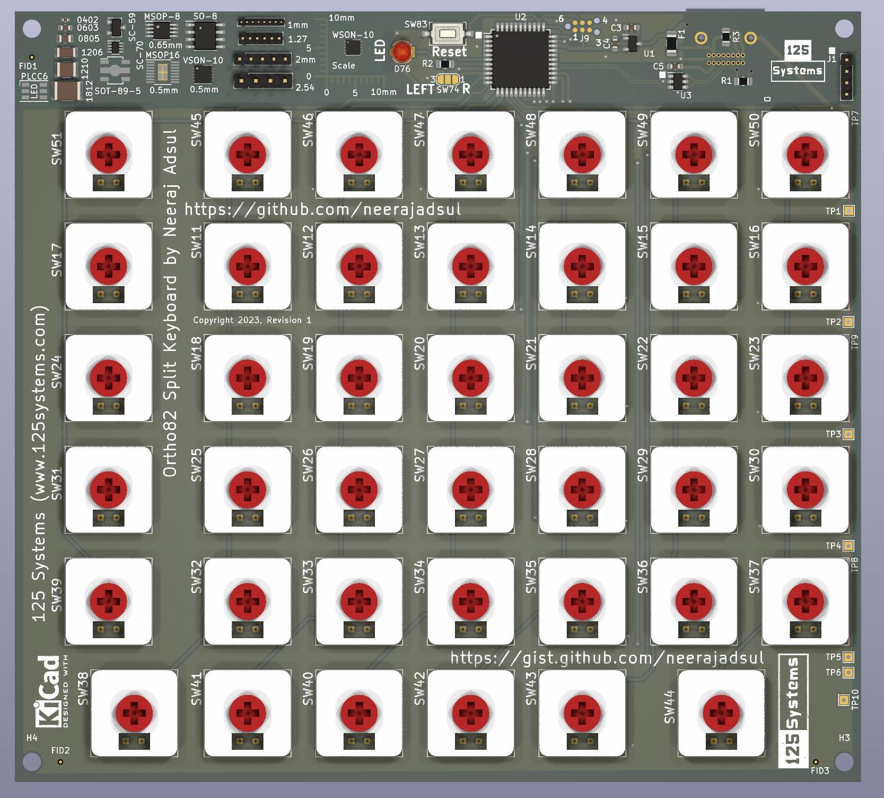
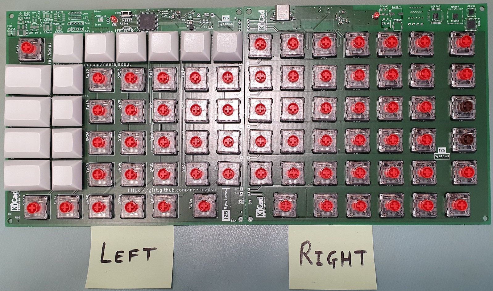

= Ortho82Split Keyboard
This is the current design iteration which has 41 keys on each half in orthogonal matrix.

KiCAD 7 Render

Fully assembled two halves of the keyboard, side by side

== Programmers Model

=== Row Signals to Microcontroller Pin

[cols="1,1,1"]
|===
| Signal | Pin | Keyboard Row

|ROW_F | PD0 | Esc, Function row
|ROW_0 | PD1 | Backtick, Numbers row
|ROW_1 | PD2 | Tab, QWERTY row
|ROW_2 | PD3 | Caps, ASDFG row
|ROW_3 | PD4 | Shift, ZXCVB row
|ROW_4 | PD5 | Ctrl, Fn, Opt, Cmd, Space row
|===

=== Column Signals to Microcontroller Pin
==== Left Half of the Split Keyboard
[cols="s,1,1,1,1,1,1,1"]
|===
|Signal | COL_0 | COL_1  | COL_2 | COL_3 | COL_4 | COL_5  | COL_6

| Pin | PC0 | PC1 | PC2 | PC3 | PC4 | PC5 | PC6 

|ROW_F | Esc | F1 | F2 | F3 | F4 | F5 | F6
|ROW_0 | ` (backtick) | 1 | 2 | 3 | 4 | 5 | 6
|ROW_1 | Tab | Q | W | E | R | T | Y
|ROW_2 | Caps | A | S | D | F | G | H
|ROW_3 | Shift | \ (backslash) | Z | X | C | V | B 
|ROW_4 | <NO KEY> | Ctrl  | MOD | Fn | Option | Cmd | Space | 
|===

==== Right Half of the Split Keyboard
[cols="s,1,1,1,1,1,1,1"]
|===
| Signal | COL_6 | COL_5  | COL_4 | COL_3 | COL_2 | COL_1  | COL_0
| Pin | PC6 | PC5 | PC4 | PC3 | PC2 | PC1 | PC0 

|ROW_F | F7 | F8 | F9 | F10 | F11 | F12 | Del
|ROW_0 | 7 | 8 | 9 | 0 | - | = | Backspace
|ROW_1 | U | I | O | P | [ | ] | Enter
|ROW_2 | J | K | L | ;: | '@ (quote) | # | Enter
|ROW_3 | N | M | ,< | .> | /? | UP | SHIFT 
|ROW_4 | Space | Cmd  | Option | LEFT | DOWN | RIGHT | <No Key> | 
|===

=== Communication between Left and Right Halves
Two halves of the split keyboard are connected by USART connection.
[cols="s,1,1"]
|===
| Signal | RXD0 | TXD0
| Pin | PE2 | PE3 
|===

=== Left/Right Half Identification and Indicator LED
Left and right are identified by setting a solder jumper on the board.
Left is 0 and right is 1.

[cols="s,1,1"]
|===
| Signal | Left-Right | Indicator LED
| Pin | PB2 | PB3 
|===

== Iterative Design History
I started with my TKL (tenkeyless) keyboard and tried to reduce the keys. 
I managed to reduce to 60 = 58 main + 2 extended keys for the keyboard.
This was partially inspired by Lily58 and other 60% keyboards avaialble. 
Also Kyria keyboard inspired me to customise the positions of the keys 
adapted to my hands and fingers. 
Following ficgure shows how I came up with draft with reduction in keys 
and logical positions in a worksheet. 

image::images/keys_reduction.png[]