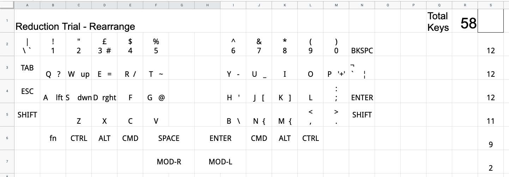

= StagyOrtho58 Keyboard

== Design
I started with my TKL (tenkeyless) keyboard and tried to reduce the keys. 
I managed to reduce to 60 = 58 main + 2 extended keys for the keyboard.
This was partially inspired by Lily58 and other 60% keyboards avaialble. 
Also Kyria keyboard inspired me to customise the positions of the keys 
adapted to my hands and fingers. 
Following ficgure shows how I came up with draft with reduction in keys 
and logical positions in a worksheet. 

